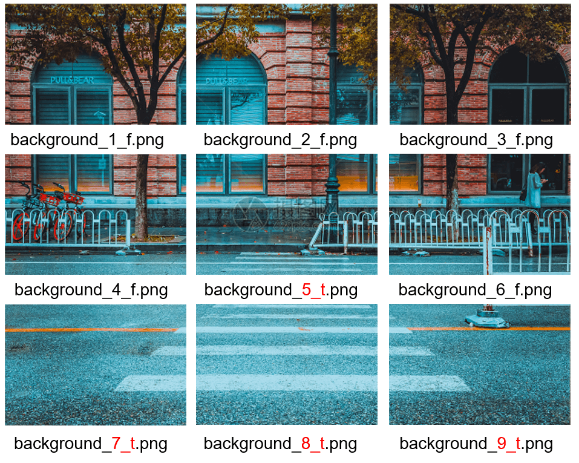
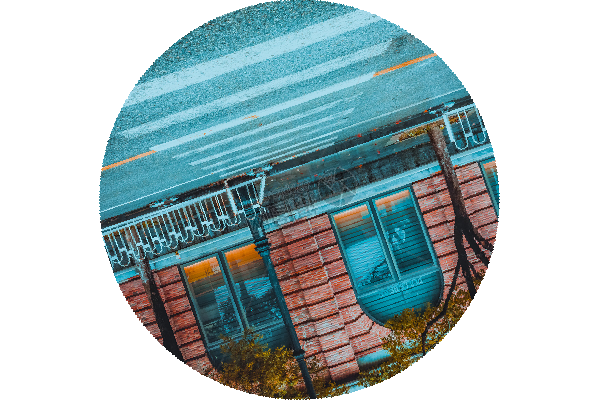

# getcap
#### 介绍
本子项目提供了getcap库，这是一个验证码生成库，目的是为其他开发人员提供验证码识别过程需要的验证码数据集，目前支持纯数字、纯字母、数字字母组合、数字运算（+、-、x）、滑块拖拽、物体识别和图片旋转这7类验证码的自动生成。另外，为了获得滑块拖拽、物体识别和图片旋转验证码的生成素材，还提供了一个用来在网络上爬取图片素材的方法类（选用）。

- **GetCaptcha**
	- 这是一个验证码生成类，其中包含纯数字、纯字母、数字字母组合、数字运算（+、-、x）、滑块拖拽、物体识别和图片旋转这7类验证码的自动生成方法：
		- 数字字母组合类验证码（位数可指定）：`get_number_and_letter()`
		- 纯字母类验证码（位数可指定）：`get_pure_letter()`
		- 纯数字类验证码（位数可指定）：`get_pure_number()`
		- 数字运算（+、-、x）：`get_number_operations()`
		- 滑块拖拽类验证码：`get_behavior_drag()`
		- 图片选装类验证码：`get_behavior_rotate()`
		- 物体识别类验证码（九宫格选点）：`get_behavior_object_recognition()`

- **BingImagesSpider（选用）**
	- 这是一个从网上爬取图片素材的方法类，其目的是为滑块拖拽、物体识别和图片旋转这三类验证码的生成爬取图片素材。
	- 例如使用该方法类爬取到素材图片：
		

		
		

		1、使用此素材图片以及默认的形状生成的滑块拖拽验证码：
		

		
		

		2、使用此素材图片生成的物体识别（“斑马线”九宫格选点，其中红色标出的是需要进行选点的含有“斑马线”的子图片）验证码：
		

		
		

		3、使用此素材图片生成的图片旋转验证码：
		

		
		

#### 环境

- 安装python3
- 为了更好的管理项目，建议使用venv:`python3 -m venv venv && source venv/bin/active`
- 执行命令`pip install -r requirements.txt`安装依赖模块

#### 安装
1.  `git clone https://gitee.com/openeuler/ai-tools.git`
2.  在 `ai-tools/example/captchaRecog-pytorch/get_captcha `文件夹下执行如下命令：
3.  `python3 setup.py build`
4.  `python3 setup.py install`
#### 使用
1. 使用方法：`from getcap.get_captcha import GetCaptcha，BingImagesSpider`
	- 在根目录下创建`datasets`文件夹
	- 调用`GetCaptcha`和`BingImagesSpider`（选用）方法类

3. 使用示例：`ai-tools/example/captchaRecog-pytorch/get_captcha`文件夹下执行`python test.py`
4. 验证码结果命名规则：
	- `get_number_and_letter()`：`真值_序号.png`
	- `get_pure_letter()`：`真值_序号.png`
	- `get_pure_number()`：`真值_序号.png`
	- `get_number_operations()`：`序号_真值.png`
	- `get_behavior_drag()`：`back/shape_序号_缺口横坐标_缺口纵坐标.png`
	- `get_behavior_rotate()`：`输入图片名_ro_旋转角度(逆时针).png`
	- `get_behavior_object_recognition()`：`输入图片名_序号_是否包含目标物体(t/f).png`
